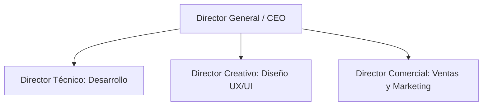
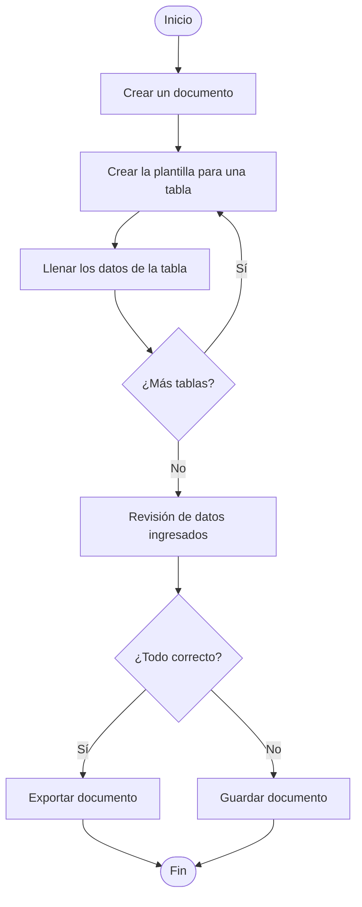
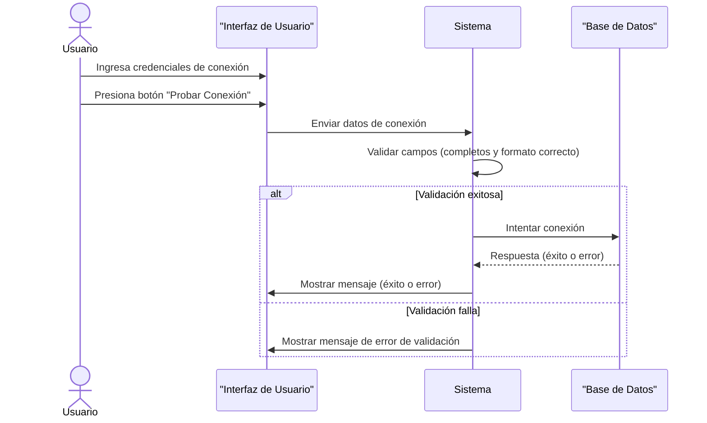
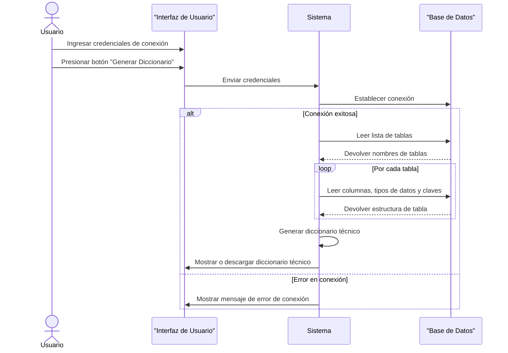
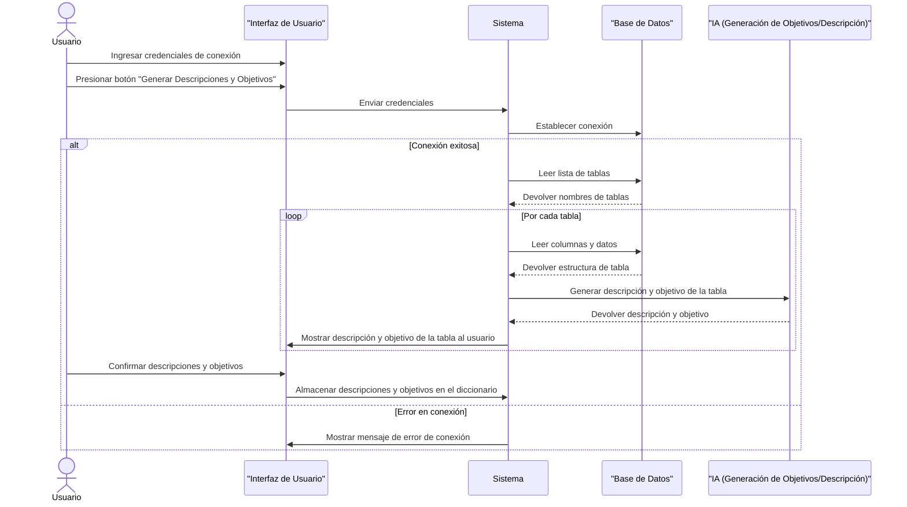
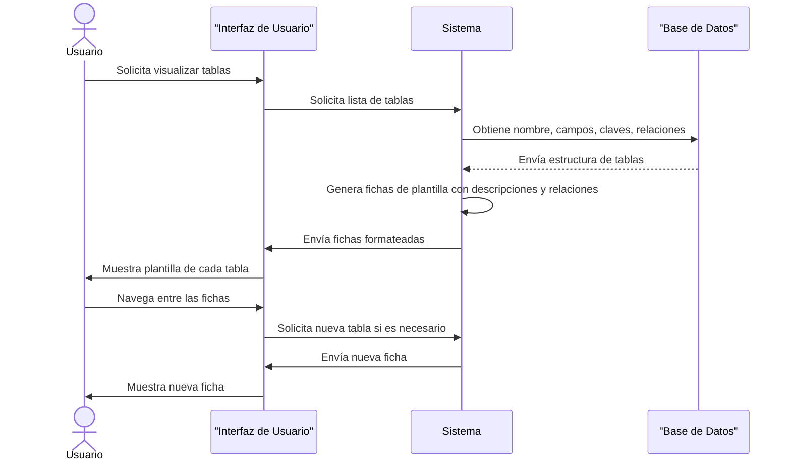
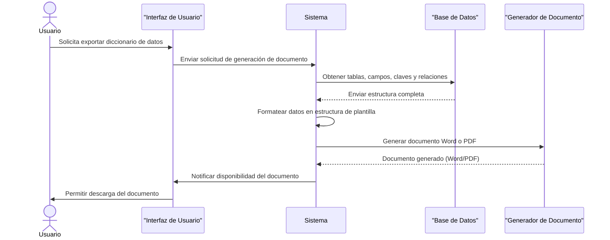
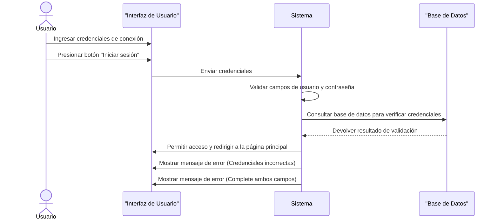
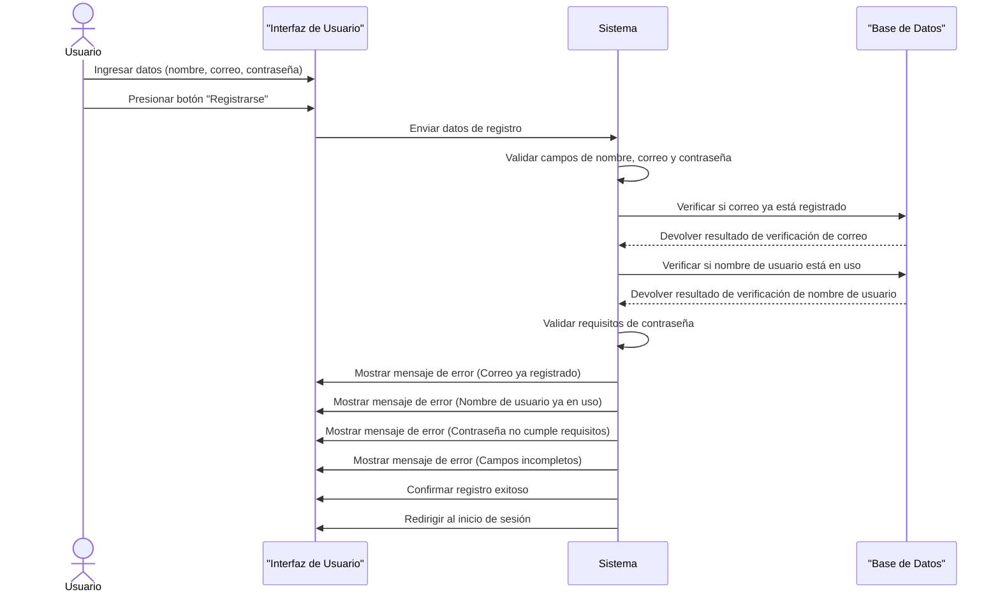

# UNIVERSIDAD PRIVADA DE TACNA

## FACULTAD DE INGENIERÍA

### Escuela Profesional de Ingeniería de Sistemas

---

### Aplicación para la Generación Automatizada de un Diccionario de Datos

**Curso**: Patrones de Software 
**Docente**: Mag. Patrick Cuadros Quiroga

---

#### Integrantes:
- Daleska Nicolle Fernandez Villanueva (2011070308)
- Andree Sebastian Flores Melendez (2017057494)
- Mario Antonio Flores Ramos (2018000597)

---

Tacna – Perú  
2025

---

## CONTROL DE VERSIONES

| Versión | Hecha por | Revisada por | Aprobada por | Fecha       | Motivo          |
|---------|-----------|--------------|--------------|-------------|-----------------|
| 1.0     | DFV       | AFM           | MFR           | 02/05/2025  | Versión Original |

---

# Plataforma De Aplicación para la Generación Automatizada de un Diccionario de Datos
## Documento de Especificación de Requerimientos de Software

### Versión 1.0

---

## CONTROL DE VERSIONES

| Versión | Hecha por | Revisada por | Aprobada por | Fecha       | Motivo          |
|---------|-----------|--------------|--------------|-------------|-----------------|
| 1.0     | DFV       | AFM           | MFR           | 02/05/2025  | Versión Original |

---

## ÍNDICE GENERAL

1. **INTRODUCCIÓN** 4  
2. **I. Generalidades de la Empresa**  
    - 1. Nombre de la Empresa 
    - 2. Visión 
    - 3. Misión 
    - 4. Organigrama  
3. **II. Visionamiento de la Empresa**
    - 1. Descripción del Problema 
    - 2. Objetivos de Negocios 
    - 3. Objetivos de Diseño  
    - 4. Alcance del proyecto  
    - 5. Viabilidad del Sistema   
    - 6. Información obtenida del Levantamiento de Información   
4. **III. Análisis de Procesos** 
    - 1. Diagrama del Proceso Actual – Diagrama de actividades 
    - 2. Diagrama del Proceso Propuesto – Diagrama de actividades Inicial 
5. **IV. Especificación de Requerimientos de Software** 
    - 1. Cuadro de Requerimientos funcionales Inicial 
    - 2. Cuadro de Requerimientos No funcionales 
    - 3. Cuadro de Requerimientos funcionales Final  
    - 4. Reglas de Negocio   
6. **V. Fase de Desarrollo** 
    - 1. Perfiles de Usuario  
    - 2. Modelo Conceptual 
        - a. Diagrama de Paquetes 
        - b. Diagrama de Casos de Uso  
        - c. Escenarios de Caso de Uso (narrativa) 
    - 3. Modelo Lógico 
        - a. Analisis de Objetos 
        - b. Diagrama de Actividades con objetos  
        - c. Diagrama de Secuencia 
        - d. Diagrama de Clases 
7. **CONCLUSIONES** 
8. **RECOMENDACIONES**  
9. **BIBLIOGRAFÍA** 
10. **WEBGRAFÍA** 

---

## INTRODUCCIÓN

## I. Generalidades de la Empresa

### 1. Nombre de la Empresa

El nombre de la empresa es **IngeTrack**.

### 2. Visión

Convertirnos en una startup líder en el desarrollo de soluciones tecnológicas innovadoras y automatizadas que impulsen la eficiencia, calidad y competitividad de empresas, estudiantes y profesionales del sector TI a nivel nacional y regional.

### 3. Misión

Diseñar y ofrecer productos tecnológicos que resuelvan problemas comunes en el desarrollo de software, automatización de procesos, gestión de datos y productividad digital, con foco en la simplicidad, eficiencia y accesibilidad.

### 4. Organigrama

---

## II. Visionamiento de la Empresa

### 1. Descripción del Problema

Hoy en día la mayoría de desarrolladores y administradores de bases de datos tienen que documentar manualmente la estructura de sus bases de datos. Esto no solo es tardado y tedioso, sino que también aumenta las probabilidades de cometer errores o de que la documentación no esté actualizada. Además, la falta de documentación estructurada complica el mantenimiento de sistemas y puede hacer más difícil que otros desarrolladores entiendan cómo funciona la base de datos. Este proyecto busca resolver estas problemáticas mediante el desarrollo de una Aplicación Web para la Generación Automatizada de Diccionarios de Datos, que permitirá documentar bases de datos de manera rápida, visual y precisa, mejorando así la eficiencia y el acceso a la información técnica dentro de los entornos académicos y profesionales.

### 2. Objetivos de Negocios

- Ofrecer una solución eficiente y automatizada para la documentación de bases de datos, que elimine procesos manuales y reduzca errores.
- Posicionar nuestra startup como una herramienta confiable para desarrolladores, DBA y estudiantes del área de sistemas.
- Generar valor agregado a través de funcionalidades adicionales como visualización, exportación y actualización automática del diccionario de datos.
- Abrir oportunidades de negocio ofreciendo el sistema como producto SaaS (Software as a Service) para instituciones académicas y empresas de tecnología.

### 3. Objetivos de Diseño

- Diseñar una interfaz web intuitiva y amigable que permita a los usuarios cargar sus bases de datos fácilmente y visualizar la información extraída.
- Implementar un sistema modular que permita escalar nuevas funciones (como compatibilidad con otros motores de base de datos).
- Asegurar una arquitectura técnica sólida que garantice rendimiento, seguridad y facilidad de mantenimiento.
- Incluir formatos de exportación flexibles (JSON, XML, CSV, PDF) para el diccionario generado.

### 4. Alcance del Proyecto

El sistema se encargará de:
- Desarrollo de una aplicación web para la generación automatizada de diccionarios de datos.
- Compatibilidad inicial con bases de datos relacionales como MySQL y SQL Server y con posibilidad de compatibilidad con otras a futuro.
- Permitir la extracción automática de metadatos (tablas, columnas, tipos de datos, claves primarias/foráneas, etc.).
- Generación del diccionario de datos estructurado y exportable en formatos como PDF y Word.
- Inclusión de una interfaz de usuario amigable, orientada tanto a usuarios técnicos como estudiantes.
- Implementación de funcionalidades básicas de seguridad para proteger el acceso a la información.
- Mejora en los procesos de documentación, mantenimiento y comprensión de estructuras de bases de datos.

### 5. Viabilidad del Sistema

El sistema es totalmente viable porque se puede desarrollar con las tecnologías y conocimientos actuales, su implementación requiere inversión en servidores y mantenimiento, además, será una herramienta útil para estudiantes, profesionales y posibles empresas, ya que les permitirá generar documentación estructurada de sus base de datos. Solo será necesario asegurarse de cumplir con las normas de protección de datos para garantizar la seguridad y legalidad de la información.

### 6. Información obtenida del Levantamiento de Información

Durante el proceso de levantamiento de información se realizaron entrevistas y encuestas dirigidas a estudiantes de ingeniería de sistemas, desarrolladores junior, con el objetivo de identificar las principales dificultades relacionadas con la documentación de estructuras de bases de datos. Asimismo, se revisaron foros especializados y se analizaron herramientas existentes en el mercado. Como resultado, se identificó que la mayoría de los profesionales documentan manualmente sus bases de datos, lo que genera retrasos, errores frecuentes y desactualización de la información. Por ello, los usuarios manifestaron la necesidad de contar con una solución que les permita automatizar este proceso de forma rápida, visual y accesible. Estos hallazgos permitieron definir los requerimientos funcionales y no funcionales del sistema, así como orientar el diseño hacia una solución que responda efectivamente a las necesidades reales de los usuarios.

---

## III. Análisis de Procesos

### 1. Diagrama del Proceso Actual – Diagrama de actividades

### 2. Diagrama del Proceso Propuesto – Diagrama de actividades Inicial

---

## IV. Especificación de Requerimientos de Software

### 1. Cuadro de Requerimientos funcionales Inicial
| ID     | Nombre del Requerimiento                        | Descripción                                                                                                                                                   | Prioridad |
|--------|--------------------------------------------------|---------------------------------------------------------------------------------------------------------------------------------------------------------------|-----------|
| RF-001 | Validación y conexión a base de datos           | La aplicación debe permitir al usuario ingresar los datos de conexión (host, usuario, contraseña y base de datos), validarlos y establecer conexión, mostrando mensajes claros. | Alta      |
| RF-002 | Extracción automática de estructura de tablas    | El sistema debe extraer automáticamente el nombre, columnas, tipo de datos, claves primarias y foráneas, y relaciones de todas las tablas de la base de datos. | Alta      |
| RF-003 | Generación automática de descripciones con IA    | La aplicación debe generar descripciones y objetivos para cada tabla usando IA, basándose en el nombre y campos de la tabla, y permitir al usuario confirmar los resultados. | Alta      |
| RF-004 | Visualización estructurada tipo plantilla        | El sistema debe mostrar cada tabla en una plantilla visual con el nombre, descripción, campos, claves y relaciones, de forma legible y navegable. | Alta      |
| RF-005 | Exportación del diccionario a Word o PDF         | El sistema debe exportar el diccionario de datos completo a un documento en formato Word o PDF con una plantilla estandarizada, y permitir su descarga. | Alta      |

### 2. Cuadro de Requerimientos No funcionales
| ID     | Nombre del Requerimiento | Descripción                                                                                                                        | Prioridad |
|--------|--------------------------|------------------------------------------------------------------------------------------------------------------------------------|-----------|
| RNF-001 | Rendimiento              | El sistema debe generar los documentos en menos de 10 segundos para bases de datos medianas (hasta 20 tablas).                    | Alta      |
| RNF-002 | Usabilidad               | La interfaz debe ser intuitiva, permitiendo su uso sin necesidad de formación técnica previa.                                      | Media     |
| RNF-003 | Portabilidad             | El sistema debe funcionar en navegadores modernos (Chrome, Firefox, Edge) sin necesidad de instalación.                            | Alta      |
| RNF-004 | Mantenibilidad           | El sistema debe estar desarrollado siguiendo buenas prácticas que faciliten su mantenimiento y escalabilidad.                      | Alta      |

### 3. Cuadro de Requerimientos funcionales Final
| ID        | Nombre del Requisito                              | Descripción de Requisito                                                                                           | Prioridad |
|-----------|---------------------------------------------------|---------------------------------------------------------------------------------------------------------------------|-----------|
| RF-001    | Registro de Usuario                               | El sistema debe permitir a los usuarios registrarse proporcionando un nombre, correo electrónico y contraseña.      | Alta      |
| RF-002    | Validación de Correo Electrónico y Nombre de Usuario | El sistema debe validar que el correo electrónico y el nombre de usuario no estén ya registrados en el sistema.     | Alta      |
| RF-003    | Validación de Contraseña                          | El sistema debe validar que la contraseña cumpla con requisitos mínimos de seguridad (longitud mínima de 8 caracteres, al menos una letra mayúscula, una letra minúscula y un carácter especial). | Alta      |
| RF-004    | Inicio de Sesión                                  | El sistema debe permitir a los usuarios iniciar sesión utilizando un nombre de usuario o correo electrónico y una contraseña. | Alta      |
| RF-005    | Mensaje de Error en Inicio de Sesión              | El sistema debe mostrar un mensaje de error si las credenciales de inicio de sesión son incorrectas.                 | Alta      |
| RF-006    | Recuperación de Contraseña                        | El sistema debe permitir que el usuario recupere su contraseña mediante un enlace de recuperación enviado a su correo electrónico. | Alta      |
| RF-007    | Ingreso de Credenciales de Conexión               | El sistema debe permitir a los usuarios ingresar credenciales de conexión (host, usuario, contraseña, base de datos) para conectarse a la base de datos. | Alta      |
| RF-008    | Validación de Campos de Conexión                  | El sistema debe validar que los campos de conexión estén completos antes de intentar realizar la conexión.         | Alta      |
| RF-009    | Validación de Formato de Credenciales de Conexión | El sistema debe validar que el formato de las credenciales de conexión (host, usuario, contraseña, base de datos) sea correcto. | Alta      |
| RF-010    | Intento de Conexión a la Base de Datos            | El sistema debe intentar conectar a la base de datos y mostrar un mensaje de éxito o error basado en el resultado de la prueba de conexión. | Alta      |
| RF-011    | Guardar Credenciales de Conexión                  | El sistema debe permitir que el usuario guarde las credenciales de conexión para futuras sesiones.                | Media     |
| RF-012    | Extracción de Estructura de la Base de Datos      | El sistema debe extraer automáticamente los nombres de las tablas, columnas, tipos de datos, claves primarias y foráneas, y relaciones entre tablas de la base de datos. | Alta      |
| RF-013    | Generación de Diccionario Técnico                 | El sistema debe generar un diccionario técnico organizado con la información extraída de la base de datos.         | Alta      |
| RF-014    | Visualización de Tablas en Formato de Plantilla   | El sistema debe permitir a los usuarios visualizar las tablas y sus detalles (campos, claves, relaciones) en formato de ficha o plantilla. | Alta      |
| RF-015    | Generación de Descripción de Tablas              | El sistema debe generar una descripción breve para cada tabla de la base de datos basada en su nombre y columnas.    | Alta      |
| RF-016    | Generación de Objetivo para Tablas               | El sistema debe usar inteligencia artificial para generar automáticamente un objetivo que describa la función principal de cada tabla. | Alta      |
| RF-017    | Almacenamiento de Descripciones y Objetivos Generados | El sistema debe permitir al usuario almacenar las descripciones y objetivos generados en el diccionario de datos.   | Alta      |
| RF-018    | Visualización de Plantillas de Tablas            | El sistema debe mostrar cada tabla de la base de datos en formato de plantilla tipo ficha, con la siguiente información: nombre de la tabla, descripción generada, campos, claves y relaciones. | Alta      |
| RF-019    | Navegación entre Plantillas de Tablas            | El sistema debe permitir al usuario navegar entre las fichas de las tablas de manera eficiente.                    | Alta      |
| RF-020    | Presentación Clara y Ordenada de la Información  | El sistema debe presentar la información de manera clara y ordenada para facilitar la lectura y comprensión.       | Alta      |
| RF-021    | Generación de Documento en Word o PDF            | El sistema debe permitir a los usuarios generar un documento en formato Word o PDF con el diccionario de datos.     | Alta      |
| RF-022    | Plantilla Profesional para Documento             | El sistema debe seguir una plantilla estandarizada y profesional para el documento generado.                       | Alta      |
| RF-023    | Descarga de Documento Generado                   | El sistema debe permitir a los usuarios descargar el archivo generado en el formato elegido (Word o PDF).         | Alta      |
| RF-024    | Generación Completa del Diccionario de Datos     | El sistema debe generar el documento con la estructura completa del diccionario de datos, incluyendo tablas, campos, descripciones, claves y relaciones. | Alta      |

### 4. Reglas de Negocio

---

## V. Fase de Desarrollo

### 1. Perfiles de Usuario

### 2. Modelo Conceptual

- **Diagrama de Paquetes**
- **Diagrama de Casos de Uso**
    @startuml
    actor "Usuario" as Usuario

    usecase "Iniciar Sesión" as UC1
    usecase "Registrar Usuario" as UC2
    usecase "Conectar a la Base de Datos" as UC3
    usecase "Extracción Automática de Estructura" as UC4
    usecase "Generación de Descripciones con IA" as UC5
    usecase "Exportar Diccionario a Word o PDF" as UC7

    Usuario --> UC1
    Usuario --> UC2
    Usuario --> UC3
    Usuario --> UC4
    Usuario --> UC7

    ' Relaciones INCLUDE
    UC4 .down.> UC3 : <<include>>  
    UC5 .down.> UC4 : <<include>>  
    UC7 .down.> UC4 : <<include>>  

    ' Relaciones EXTEND
    UC1 .up.> UC2 : <<extend>>  
    @enduml

- **Escenarios de Caso de Uso (narrativa)**

### 3. Modelo Lógico

- **Análisis de Objetos**
- **Diagrama de Actividades con objetos**
- **Diagrama de Secuencia**

Conexión a la base de datos

Extracción automática de estructura

Generación de descripciones con IA 

Visualización estructurada tipo plantilla

Exportación del diccionario a Word o PDF

Inicio de sesión para usuarios

Registro de nuevos usuarios

- **Diagrama de Clases**

---

## CONCLUSIONES

## RECOMENDACIONES

## BIBLIOGRAFÍA

## WEBGRAFÍA