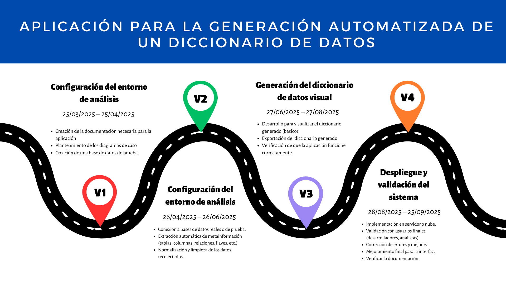

# PROYECTO APLICACION PARA LA GENERACION AUTOMATIZADA DE UN DICCIONARIO DE DATOS

# **UNIVERSIDAD PRIVADA DE TACNA**  
## **FACULTAD DE INGENIERÍA**  
### **ESCUELA PROFESIONAL DE INGENIERÍA DE SISTEMAS**  

---

# **APLICACIÓN PARA LA GENERACIÓN AUTOMATIZADA DE UN DICCIONARIO DE DATOS**

## **Curso:** Inteligencia de Negocios  
## **Docente:** Mag. Patrick Cuadros Quiroga  

---

### **Integrantes:**  
- **Flores Melendez Andree Sebastian**  
- **Flores Ramos Mario Anthonio**  
- **Fernandez Villanueva Daleska Fernandez**  

---

## Objetivo Principal:
Desarrollar una aplicación capaz de conectarse a bases de datos relacionales para extraer automáticamente los metadatos y generar un diccionario de datos estructurado y exportable, facilitando la documentación técnica en proyectos de software.

## Objetivos Secundarios:
- Automatizar la extracción de metadatos de bases de datos.
- Generar un diccionario de datos estructurado en un formato accesible.
- Implementar una interfaz de usuario amigable para gestionar y actualizar los diccionarios de datos.
- Facilitar la integración de la aplicación con sistemas de gestión de bases de datos.

---

## RoadMap:

---

