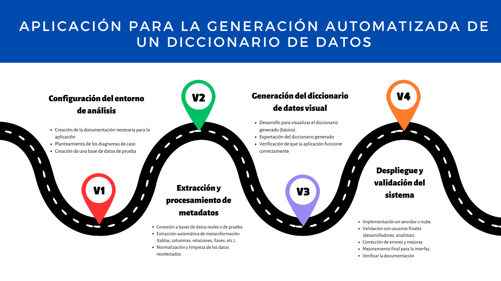

# PROYECTO APLICACION PARA LA GENERACION AUTOMATIZADA DE UN DICCIONARIO DE DATOS

# **UNIVERSIDAD PRIVADA DE TACNA**  
## **FACULTAD DE INGENIERÍA**  
### **ESCUELA PROFESIONAL DE INGENIERÍA DE SISTEMAS**  

---

# **APLICACIÓN PARA LA GENERACIÓN AUTOMATIZADA DE UN DICCIONARIO DE DATOS**

## **Curso:** Inteligencia de Negocios  
## **Docente:** Mag. Patrick Cuadros Quiroga  

---

### **Integrantes:**  
- **Flores Melendez Andree Sebastian**  
- **Flores Ramos Mario Anthonio**  
- **Fernandez Villanueva Daleska Fernandez**  

---

## Objetivo Principal:
Desarrollar una aplicación capaz de conectarse a bases de datos relacionales para extraer automáticamente los metadatos y generar un diccionario de datos estructurado y exportable, facilitando la documentación técnica en proyectos de software.

## Objetivos Secundarios:
1. Conectar la herramienta a la bases de datos
2. Procesar y almacenar los metadatos en formatos estructurados
3. Crear una interfaz que visualice el diccionario de datos.
4. Permitir la exportación de resultados.
5. Desplegar la aplicación para su uso por parte de desarrolladores y analistas.

---

## RoadMap:

---

